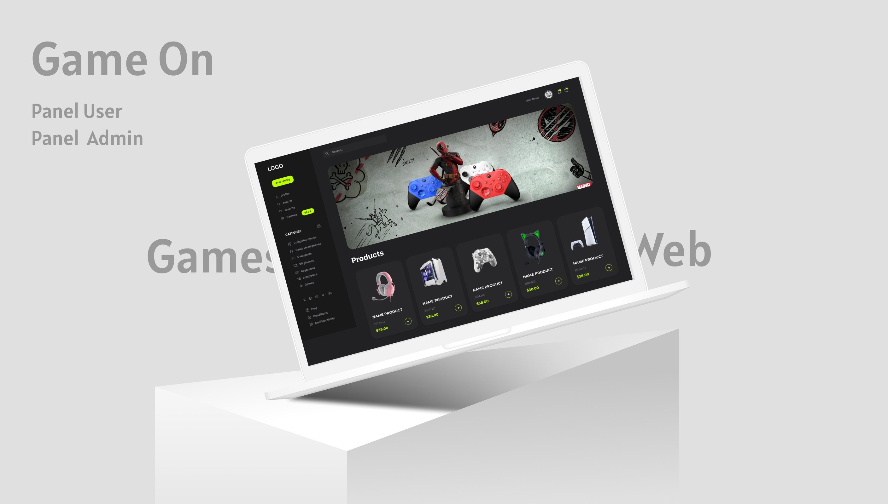

# GameOn

**A collaborative project by [DevBlP](https://github.com/devblp) and [barbodmsd](https://github.com/barbodmsd) .**



## Project Overview

GameOn is a comprehensive web application designed for gaming enthusiasts. It offers a robust platform for users to explore and purchase a variety of gaming products. The application features both user and admin panels, ensuring a seamless experience for both customers and administrators.

## Features

- **User Panel:** 
  - Browse and purchase gaming products
  - User account management
  - Order history and tracking

- **Admin Panel:**
  - Product management (add, edit, delete products)
  - Order management
  - User management

## Technologies Used

- **Frontend:**
  - React.js
  - Tailwind CSS
  -   
- **Backend:**
  - Node.js
  - Express.js
  - MongoDB

- **Tools & Libraries:**
  - Next.js
  - JWT (JSON Web Token) for authentication
  - Redux for state management

## Installation and Setup

To run this project locally, follow these steps:

1. **Clone the repository:**
    ```bash
    git clone https://github.com/barbodmsd/GameOn.git
    cd GameOn
    ```

2. **Install dependencies:**
    ```bash
    npm install
    ```

3. **Set up environment variables:**
    Create a `.env` file in the root directory and add the necessary environment variables:
    ```plaintext
    MONGO_URI=your_mongodb_uri
    JWT_SECRET=your_jwt_secret
    ```

4. **Run the application:**
    ```bash
    npm run dev
    ```

5. **Open your browser and visit:**
    ```plaintext
    http://localhost:3000
    ```

## Contributing

We welcome contributions to improve GameOn. To contribute, please follow these steps:

1. **Fork the repository.**
2. **Create a new branch:**
    ```bash
    git checkout -b feature-name
    ```
3. **Make your changes and commit them:**
    ```bash
    git commit -m "Description of your changes"
    ```
4. **Push to the branch:**
    ```bash
    git push origin feature-name
    ```
5. **Create a pull request.**

## License

This project is licensed under the MIT License. See the [LICENSE](./LICENSE) file for more details.

## Contact

For any questions or feedback, please contact us at:

- [DevBlP](https://github.com/devblp)
- [barbodmsd](https://github.com/barbodmsd)


---

Enjoy gaming with GameOn!
